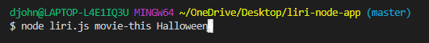
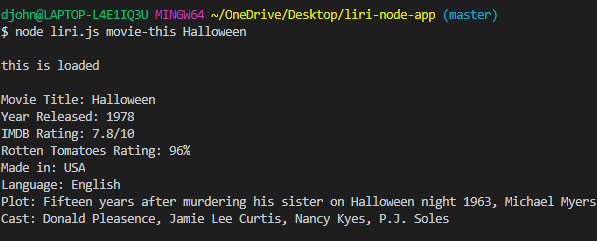
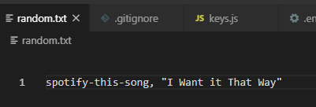
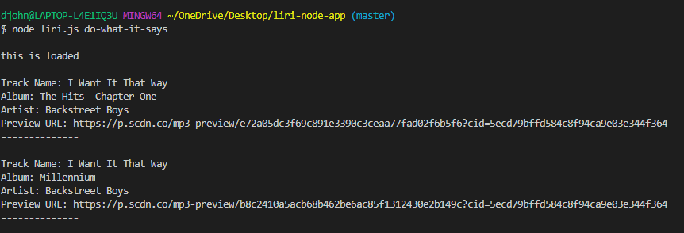
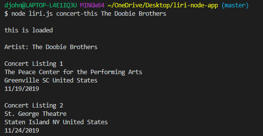
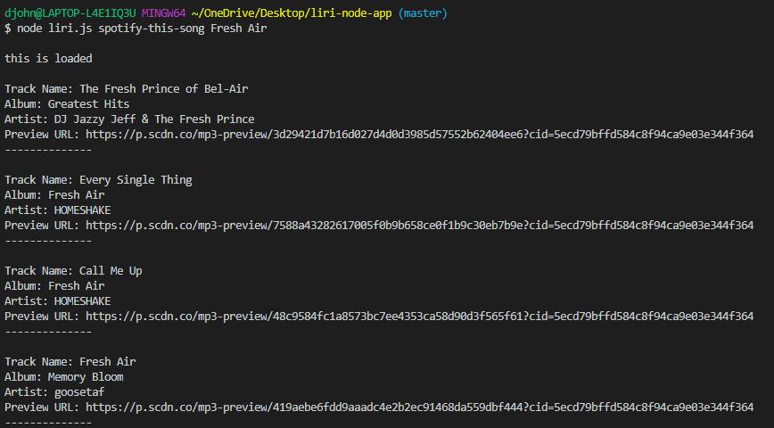
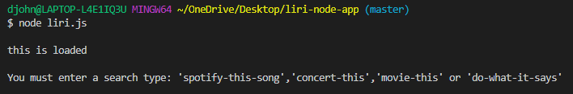
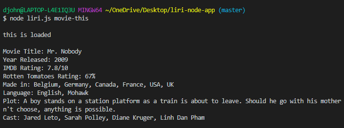
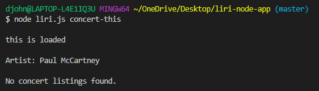
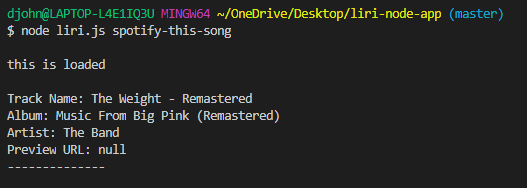

## liri-node-app

#### The liri-node-app is an application that retrieves information for the user via a *Language* Interpretation and Recognition Interface (LIRI). It operates in a manner analogous to the iPhone's SIRI which is a *Speech* Interpretation and Recognition Interface.
:space_invader:
#### The LIRI bot retrieves 3 type of information based on the user selected Inquiry Method and a Search Item of the user's choice.
Inquiry Method | Search Item | Database Queried | Information Retrieved
-------------- | ----------- | ---------------- | ---------------------
movie-this | Movie Name | OMDB | Movie Title
-- | -- |-- | Year Released 
-- | -- |-- | IMDB Rating
-- | -- |-- | Rotten Tomatoes Rating 
-- | -- |-- | Country Where it was Made
-- | -- |-- | Language 
-- | -- |-- | Plot 
-- | -- |-- | Cast 
concert-this | Artist Name | bandsintown | 
-- | -- |-- | Concert venue 
-- | -- |-- | Venue City
-- | -- |-- | Concert Date 
spotify-this-song | Track Name | node-spotify | Track Name 
-- | -- |-- | Album
-- | -- |-- | Performing Artist
-- | -- |-- | URL to Preview Sound File
do-what-it-says | text file input | text file input |  ---
#### The application helps the user retrieve information regarding three different forms of entertainment: movies, concerts, and online music. To use the application, the user must first downlown the code from github. The use of the Spotify inquiry requires that the user set up a Spotify developer account the create an app to get the needed security keys which must be stored in a .env file in the directory where the program will be run. Additionally, the user will also need to have node.js and the following modules installed via npm in the directory where the program will be run: axios, node-spotify-api, and dotenv.
:space_invader:
#### The application can be run after all the required downloads are installed, by opening the liri.js file and opening a new terminal. At the command line first type node followed by the method and a search item. When 'enter' is pressed the application will run. For example, to run an inquiry for the movie 'Halloween', the command line should look as follows-

#### After hitting enter, the code executes and the results of the inquiry are displayed -

#### The other methods are called in a similar manner except for 'do-what-it-says' where the inquiry and search item are imported from the random.txt file. 

#### The 'concert-this' method returns as many listing are there are in the bands-in-town database for an artist.

#### The 'spotify-this-song' returns 20 listings (not all shown) since the 'track' search used returns not only the tracks containing the key search words but also albums with the key search words, so that the track one is searching for may not be the first on the list.

#### If no inquiry method is entered, the user will be prompted to do so.

#### If no search item is entered, a default search item is included with each method.

:space_invader:
#### If you need additional help with getting the program to run, you can contact the sole contributor at ronfud2000@gmail.com
#### Hope you have fun with the app!
:space_invader: